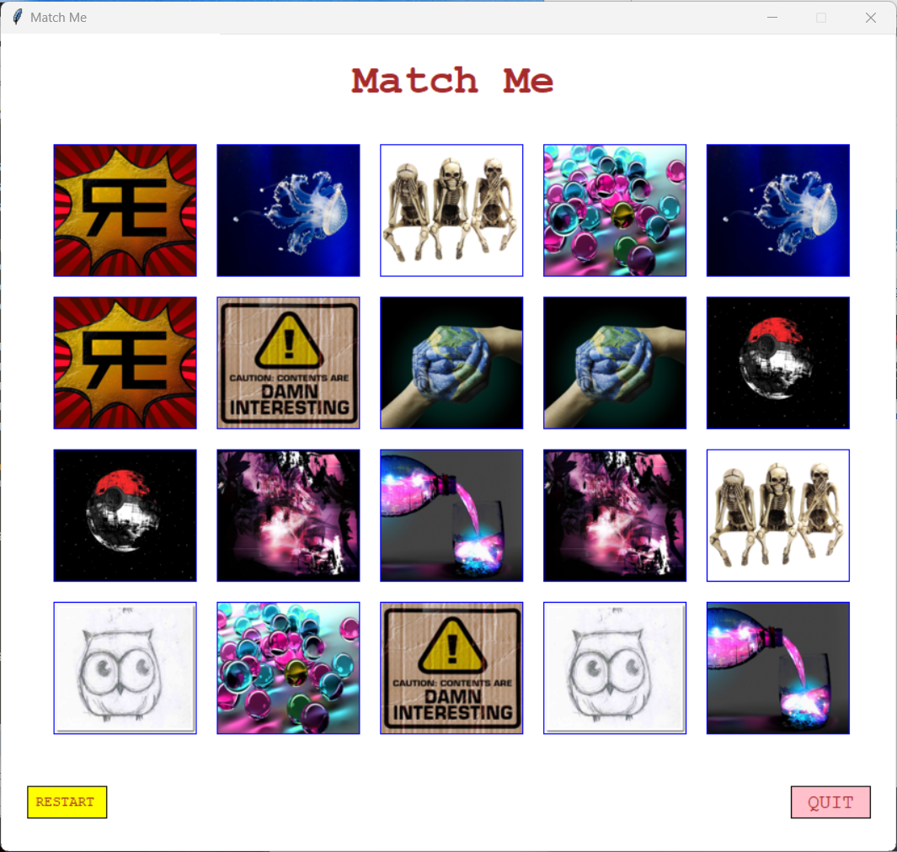
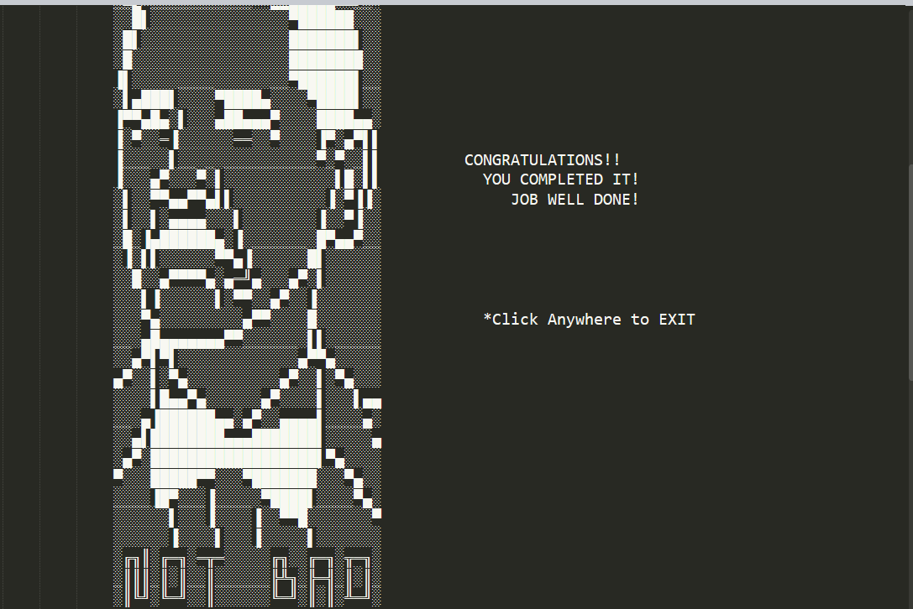

# Photo Match Game

This is a game where players have to match photos from 20 boxes. Each box contains a hidden photo, which only appears when the player clicks on it. Once the player has clicked on two boxes and the consecutive photos are the same, the photos will be opened permanently. The goal of the game is to open all the boxes and match all the photos.

## How to Play
1. Click on any box to reveal its hidden photo.
2. Click on another box to reveal its hidden photo.
3. If the consecutive photos are the same, they will be opened permanently. If not, the boxes will be hidden again.
4. Keep clicking on boxes until all photos are matched and opened.

## Technologies Used:
 - This game was created using Python.

## How to Contribute:
If you find any bugs or issues with the game, feel free to create an issue or submit a pull request. Contributions are always welcome!
